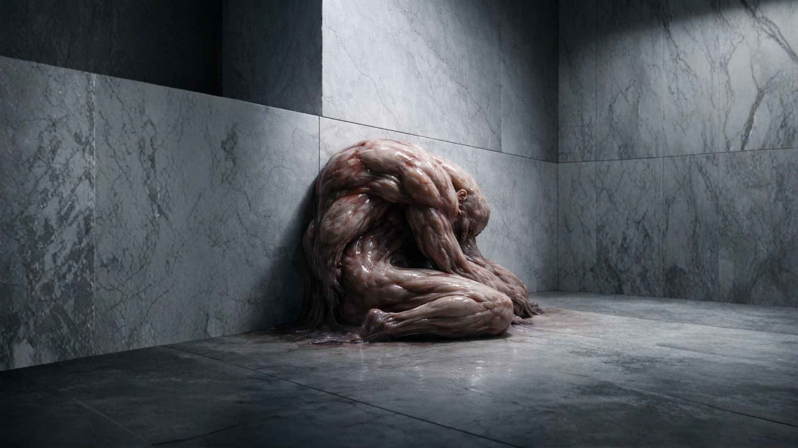

# The Marble Does Not Yield

<p align="center">
  
</p>

A cinematic, single-page narrative experience built with Next.js 14, TypeScript, and Tailwind CSS.

This project explores long-form storytelling on the web, combining restrained animation, careful typography, and accessibility-first design to support serious prose without distraction.

---

## Architecture

This is a production-ready storytelling site built with:

- **Next.js 14 App Router** (React Server Components)
- **TypeScript** throughout
- **Tailwind CSS** for styling
- **Custom markdown processing** with remark/rehype
- **Scroll-triggered animations** via IntersectionObserver
- **Responsive image handling** (desktop/mobile hero variants)
- **Accessibility-first** design (semantic HTML, WCAG contrast, reduced motion)

---

## Quick Start

### 1. Install Dependencies

```bash
npm install
```

### 2. Verify Images

Ensure the following images are present:

**Story Images (required):**

```
public/images/
  ├── main-header-desktop.jpg   (1920×1080+, landscape hero)
  ├── main-header-mobile.jpg    (1080×1920+, portrait hero)
  └── ending.jpg                (1920×1080+, final image)
```

**Social / Meta Images (before deploy):**

```
public/images/
  └── og-image.jpg              (1200×630, social previews)
```

**Favicons (before deploy):**

```
public/
  ├── favicon.ico               (32×32, legacy browsers)
  ├── favicon.svg               (scalable, modern browsers)
  └── apple-touch-icon.png      (180×180, iOS)
```

See **ASSETS_NEEDED.md** for detailed specifications and creation guidelines.

---

### 3. Edit Story (Optional)

The story content lives in:

```
content/story.md
```

The prose is preserved word-for-word.
Image placement is controlled using this token:

- `[[ENDING_IMAGE]]` — inserts the final image at that position

---

### 4. Run Development Server

```bash
npm run dev
```

Open [http://localhost:3000](http://localhost:3000)

---

### 5. Build for Production

```bash
npm run build
npm start
```

---

## Deploy to Vercel

### Option A: Vercel CLI

```bash
npm install -g vercel
vercel
```

### Option B: GitHub → Vercel

1. Push the repository to GitHub
2. Go to [https://vercel.com/new](https://vercel.com/new)
3. Import the repository
4. Vercel auto-detects Next.js and deploys

No additional configuration is required.

---

## File Structure

```text
marble-does-not-yield/
├── app/
│   ├── layout.tsx           # Root layout, fonts, metadata
│   ├── page.tsx             # Main page (Hero + StoryRenderer)
│   └── globals.css          # Global styles and typography
├── components/
│   ├── Hero.tsx             # Full-screen hero with title animation
│   ├── StoryRenderer.tsx    # Markdown renderer with image injection
│   └── ScrollFadeImage.tsx  # Scroll-based fade-in image component
├── content/
│   └── story.md             # Story content
├── lib/
│   ├── md.ts                # Markdown loader and parser
│   └── motion.ts            # Centralized animation settings
├── public/
│   └── images/              # Image assets
├── package.json
├── tailwind.config.ts
├── tsconfig.json
└── next.config.js
```

---

## Design System

### Typography

- **Display font**: Fraunces
- **Body font**: Source Serif 4
- **Base size**: 18px → 20px (responsive)
- **Line height**: 1.75–1.8
- **Max width**: 72ch

### Color Palette

```css
--void: #0d0d0d        /* background */
--parchment: #e8e6e1   /* primary text */
--ash: #6b6b6b         /* muted accents */
```

### Animation Philosophy

- Hero establishes tone
- Text fades quietly as the reader progresses
- Ending image is constrained to the reading width
- All motion is disabled when `prefers-reduced-motion` is enabled

---

## Accessibility

- Semantic HTML throughout
- WCAG AAA contrast ratios
- Keyboard-visible focus states
- Motion-respecting animations
- Decorative images use empty alt text per WCAG guidance

---

## Performance

- Next.js image optimization
- Priority loading for hero imagery
- Lazy loading below the fold
- Automatic code splitting and tree shaking

---

## Branding Principles

Typography is intentionally restrained. Contrast is achieved through rhythm, spacing, and hierarchy rather than multiple font families. The system stays neutral so the story can provide the emotion.

**Font Usage:**

- **Fraunces (Display):** Titles, headings, bylines only
- **Source Serif 4 (Body):** All prose, reading text

**Design Philosophy:**

- Literary, not decorative
- Reader-focused, not system-focused
- Restrained, not expressive

For complete design guidelines, see [DESIGN_SYSTEM.md](./DESIGN_SYSTEM.md).

---

## License

This is a custom narrative project.
All rights reserved.
